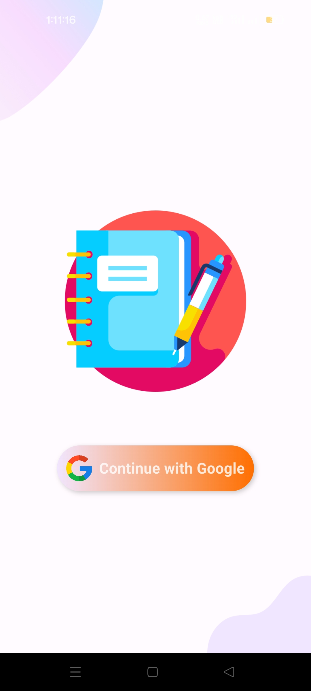
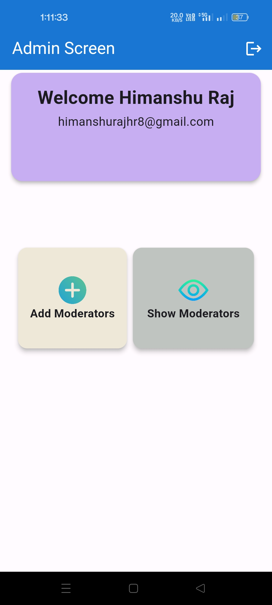
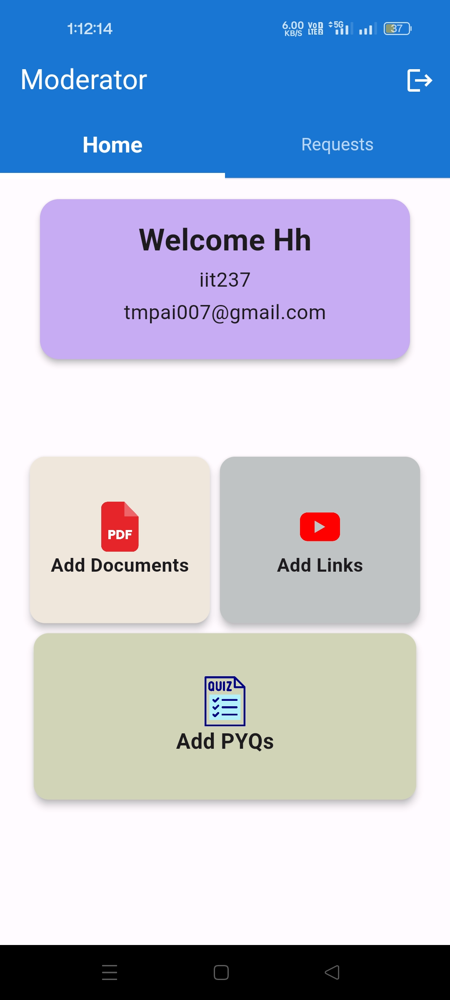
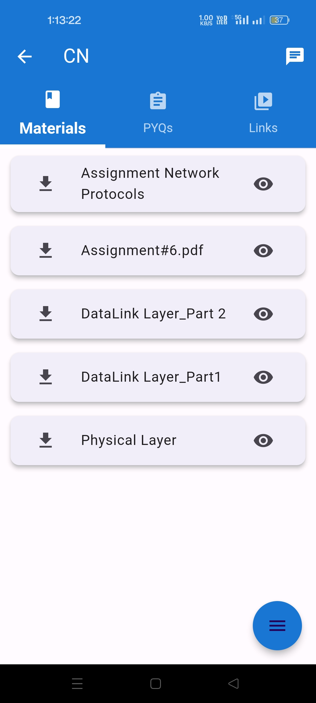
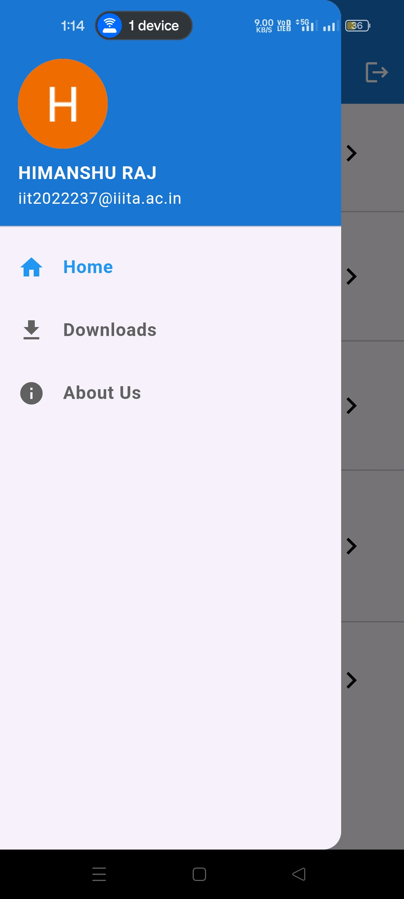

# GradePlus App

Welcome to the GradePlus App! This app is designed to provide IIITA students with access to lecture PDFs, previous year papers, study materials, and a chat feature for each subject. Students can also submit their own materials for moderation and inclusion in the database.

## Features

- **Lecture PDFs**: Access and download lecture notes.
- **Previous Year Papers**: Browse and download past exam papers.
- **Study Materials**: Find links to additional study resources like YouTube videos and Google Drive files.
- **Subject Chat**: Participate in subject-specific chats to discuss and collaborate with classmates.
- **Material Submission**: Submit study materials for verification and inclusion in the app.


## Screenshots

### Login Screen


### Admin Screen
- **Admin Dashboard**: Manage moderators and content.
  

### Moderator Screen
- **Moderator Dashboard**: Review and approve submitted materials.
  

### User Screen
- **Home Screen**: Access and download lecture notes, past papers, and other study resources.
  
  
- **Subject Screen**: 
  

  
- **Side Navigation**: 
  

## Tech Stack

- **Languages**: Dart
- **Framework**: Flutter
- **Backend**: Firebase (for authentication, real-time database)
- **Database**: Firestore
- **Tools**: Android Studio


## Getting Started

Follow these instructions to set up the project locally on your machine.

### Prerequisites

- Flutter SDK: [Install Flutter](https://flutter.dev/docs/get-started/install)
- Android Studio or Visual Studio Code for development

### Installation

1. **Clone the repository:**

   ```bash
   git clone https://github.com/himanshuhr8/GradePlus.git
   cd GradePlus
